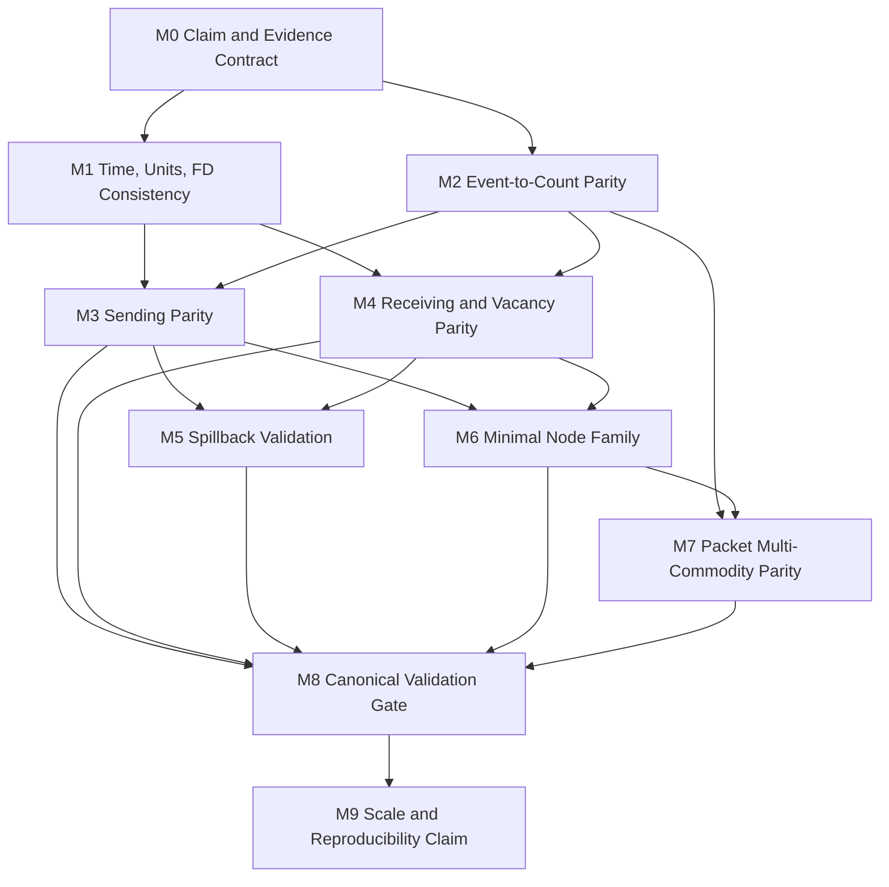

# Academic LTM Parity — Technical Implementation Plan

Status: implementation planning document.
Source of authority: `academic_ltm_parity_specification_v1.pdf` and the current repository architecture.
Non-scope: this document does not redefine parity, broaden the scientific claim, or replace the event-led loading architecture.

## Summary

Urban Cybernetics should reach academic LTM parity by adding an explicit parity-eligible loading/profile path while preserving the current event-led packet architecture. The canonical event log remains physical truth. Packet identity, immutable topology, loading ownership, and read-only observability/routing/provenance/inspection boundaries remain non-negotiable.

The recommended migration strategy is additive:

- keep existing loading behaviour available as the legacy-compatible profile;
- introduce `parity_ltm_v1` as the only profile eligible for parity evidence;
- make parity counts, ordinals, validation status, and failure labels auditable through provenance;
- preserve existing tests wherever practical;
- attach city-scale claims only after mechanism validation passes.

## Repository Ownership Map

Core physical records:

- `src/urban_cybernetics/core/link.py`
- `src/urban_cybernetics/core/event.py`
- `src/urban_cybernetics/core/packet.py`
- `src/urban_cybernetics/core/node.py`
- `src/urban_cybernetics/core/demand.py`

Loading owner:

- `src/urban_cybernetics/loading/engine.py`
- `src/urban_cybernetics/loading/cumulative_counts.py`
- `src/urban_cybernetics/loading/sending.py`
- `src/urban_cybernetics/loading/receiving.py`
- `src/urban_cybernetics/loading/transfer_policy.py`

Static inputs and adapters:

- `src/urban_cybernetics/topology/canonical.py`
- `src/urban_cybernetics/topology/routes.py`
- `src/urban_cybernetics/demand/manifest.py`
- `src/urban_cybernetics/demand/resolution.py`
- `src/urban_cybernetics/demand/scheduled_loading.py`
- `src/urban_cybernetics/benchmarks/sioux_falls_demand_smoke.py`

Read-only layers:

- `src/urban_cybernetics/observability/`
- `src/urban_cybernetics/routing/`
- `src/urban_cybernetics/provenance/`
- `src/urban_cybernetics/inspection/`
- `src/urban_cybernetics/validation/`
- `src/urban_cybernetics/experiments/`

## Strategy Choices

| Choice | Options | Recommendation |
|---|---|---|
| Physical truth | Make cumulative arrays canonical, or keep event truth with checked count projections | Keep event truth; parity counts must be complete, replayable projections. |
| Migration mode | Big-bang replace current kernel, or explicit parity profile | Use explicit `parity_ltm_v1`; keep legacy behaviour for existing tests until parity is ratified. |
| Link parameters | Overload current `Link` fields, or add resolved parity parameter view | Resolve parity parameters from immutable `Link` and topology metadata; do not store dynamic state on topology. |
| Counts | Recompute from event log every query, or checked materialised indexes | Materialise hot-path counts and ordinals inside loading; debug/test replay must prove equality to events. |
| Validation | City benchmark first, or synthetic/reference fixtures first | Synthetic/reference fixtures first; Cork, Anaheim, and Los Angeles only after M8. |

## Global Invariants

These invariants must remain true through every milestone:

- Loading engine owns canonical physical truth.
- Event sequence order remains canonical.
- Packet IDs remain stable.
- Topology records never store queues, cumulative counts, live storage, or live traffic state.
- Routing authorities do not mutate loading, topology, packets, or counts.
- Observation frames stay immutable sampled artifacts.
- Inspection and provenance remain derived evidence, not simulation state.
- Existing `validation_status` semantics remain `not_run`, `passed`, or `failed`.
- Legacy-compatible runs are not parity evidence unless explicitly validated under the parity profile.

## Existing Tests to Preserve

The current test suite should continue passing under the legacy-compatible profile. This includes the conservation, cumulative-count, sending, receiving, FIFO, merge, diverge, route progression, topology, demand, observability, routing authority, provenance, inspection, Sioux Falls smoke, memory-hardening, and import-baseline tests under `tests/`.

Parity tests should be added beside these tests rather than rewriting the current suite prematurely.

## Milestone Plan

| Milestone | Must Change | Must Remain Unchanged | New Structures | Compatibility Layer | New Tests | Migration Risk | Complexity |
|---|---|---|---|---|---|---|---|
| M0 Claim and evidence contract | `validation`, `provenance/run.py`, mechanics/node/research specs | Loading mechanics, event schema, packet identity | `ParityEvidenceContract`, `ParityRunEvidence`, profile/status labels | Legacy runs marked non-parity or unassessed | claim metadata, failure semantics, config snapshot tests | Labels can outrun implementation | Medium |
| M1 Time, units, and FD consistency | `core/link.py`, `topology/canonical.py`, `config.py`, provenance config | Movement mechanics, routing, observability | resolved physical link parameters, timestep report, capacity discretisation policy | Legacy declared-capacity/storage mode | FD consistency, units, timestep, lane capacity | Prior timing/capacity may shift | High |
| M2 Event-to-count parity contract | `loading/cumulative_counts.py`, `loading/engine.py` | Event schema, packet IDs, topology | boundary checkpoints, packet ordinals, route count keys | Current public count methods preserved | checkpoint equality, ordinal, replay, route counts | Off-by-one errors affect all later work | High |
| M3 Sending parity | `loading/sending.py`, `loading/engine.py`, validation fixtures | Read-only layers and topology | link demand view, capacity carry, sending trace | Existing `LinkSendingView` retained | analytical sending, long-horizon capacity, FIFO ordinal discharge | Transfer/completion ticks change | High |
| M4 Receiving and vacancy parity | `loading/receiving.py`, `loading/engine.py`, validation fixtures | Routing/observability/provenance write boundaries | link supply view, vacancy lag state, receiving cause | Immediate-storage receiving remains legacy | backward-wave, supply curve, closure-vs-physical cause | Queue release/admission changes network-wide | Very high |
| M5 Spillback validation | `loading/engine.py`, `loading/receiving.py`, inspection labels if needed | Queue event ontology, event truth | spillback trace, queue-curve comparison, gridlock status | Queue events remain canonical diagnostics | lane-drop, three-link propagation, loop/gridlock | High-demand outcomes move | High |
| M6 Minimal node family | `core/node.py`, `loading/transfer_policy.py`, `loading/engine.py` | Link physics, packet/event identity | node model spec, merge priority spec, node trace | Global FIFO remains legacy/default | one-to-one, strict diverge, priority merge | Merge timing and fairness change | High |
| M7 Packet and multi-commodity parity | counts, engine, scheduled loading, inspection/probe readers | Packet identity and demand pre-packet boundary | commodity key, route counts, ordinal map, route travel-time curve | Unit packets only; weighted packets rejected | route-count sums, ordinal FIFO, high-commodity memory | Memory pressure and reroute ambiguity | Very high |
| M8 Canonical validation gate | `validation`, tests, fixture data, provenance status | Physics once under validation | reference fixtures, output digests, validation result | Current synthetic suite remains current-semantics suite | analytical/reference LTM, timestep convergence, replay/failure | Circular validation risk | High |
| M9 Scale and reproducibility claim | benchmarks, provenance, artifact indexing, inspection summaries | Kernel semantics after M8 | scale profile, kernel version, reproducibility bundle, performance budget | Sioux Falls remains plumbing evidence | scale ladder, rerun reproducibility, memory/runtime budgets | Scale may be mistaken for parity | Medium-high |

## Dependency Graph

Work that can proceed independently after M0: validation harness shell, fixture format, provenance labels, performance baseline collection, and preservation-test collection. Their acceptance still depends on the upstream milestone evidence.

## Bottlenecks and Risks

Architectural bottlenecks:

- `LoadingEngine.step()` concentrates phase ordering, final-link completion, receiving slot calculation, node policy, transfer execution, and queueing.
- `Link` mixes declared synthetic caps with physical metadata.
- `validation` starts as a contract shell rather than a reference harness.
- Node policy inputs do not yet carry priority, node type, or decision traces.

Performance risks:

- event scans in count views;
- `tuple(events)` copies;
- route-disaggregated counts by tick, link, and route;
- per-packet ordinal maps;
- list removal and FIFO index lookups on large link memberships;
- long-horizon reference comparisons.

Memory risks:

- full event log plus materialised current views plus count checkpoints plus route-disaggregated counts plus validation traces;
- M2 and M7 need bounded indexes and replay checks rather than unchecked duplicate histories.

Validation risks:

- using UC to validate UC;
- exact equality where only bounded discrete error is valid;
- city smoke runs being treated as model validation;
- parity profile leaking into legacy tests before evidence gates.

Literature interpretation risks:

- triangular FD parameter closure;
- integer capacity carry;
- merge priority share for indivisible packets;
- queue event duration versus cumulative queue definition;
- signal nodes remaining excluded or extension-scoped.

## Recommended Engineering Task Order

1. Add explicit parity claim/status vocabulary to run evidence. Files: `validation`, `provenance/run.py`. Tests: provenance and claim metadata tests. Claim: T0 evidence contract. Must not change loading mechanics.
2. Record model-kernel/profile ID in reproducibility config. Files: `config.py`, `provenance/run.py`. Tests: config snapshot tests. Claim: T0. Must not change event schema.
3. Define legacy vs parity eligibility labels. Files: `validation`, `config.py`. Tests: profile classification tests. Claim: T0. Must not change legacy default.
4. Add failure semantics for partial/interrupted/timed-out/inconsistent parity evidence. Files: `validation`, provenance. Tests: failed-run parity tests. Claim: T0. Must not change inspection read-only behaviour.
5. Create validation package shell with no physics. Files: `validation`. Tests: import baseline and validation smoke tests. Claim: T0. Must not import loading from validation claim labels.
6. Add resolved physical-link parameter contract. Files: `core/link.py`, `topology/canonical.py`. Tests: FD foundations. Claim: T1 prerequisite. Must not change topology immutability.
7. Separate declared legacy capacity from parity physical capacity. Files: `core/link.py`, `topology/canonical.py`. Tests: topology conversion. Claim: T1 prerequisite. Must not change synthetic link behaviour.
8. Define lane-aware capacity interpretation. Files: `topology/canonical.py`. Tests: lane capacity. Claim: T1 prerequisite. Must not change source provenance.
9. Add timestep admissibility checks for parity profile. Files: `config.py`, `core/link.py`. Tests: timestep admissibility. Claim: T1 prerequisite. Must not change fixed-tick architecture.
10. Add backward-wave lag derivation and validation. Files: `core/link.py`. Tests: FD/backward lag. Claim: T1 prerequisite. Must not change receiving behaviour until M4.
11. Preserve legacy storage default outside parity profile. Files: `core/link.py`, `topology/canonical.py`. Tests: existing storage tests. Claim: T1 prerequisite. Must not break legacy tests.
12. Add count checkpoint data model from events. Files: `loading/cumulative_counts.py`. Tests: cumulative count checkpoint tests. Claim: T0/T1. Must not change event canonicality.
13. Add packet boundary ordinal reconstruction. Files: `loading/cumulative_counts.py`, `loading/engine.py`. Tests: ordinal tests. Claim: T3 prerequisite. Must not change packet IDs.
14. Add route-disaggregated count projection. Files: `loading/cumulative_counts.py`. Tests: route-count tests. Claim: T3 prerequisite. Must not change demand manifest semantics.
15. Add event/count consistency failure checks. Files: `loading/engine.py`. Tests: count mismatch tests. Claim: T0/T1. Must not change event log authority.
16. Add replay-from-prefix count reconstruction tests. Files: `validation`, tests. Tests: replay tests. Claim: T0/T1. Must not change full event order.
17. Introduce parity sending view based on lagged counts. Files: `loading/sending.py`. Tests: analytical sending. Claim: T1. Must not break legacy sending view callers.
18. Preserve FIFO packet selection from count ordinals. Files: `loading/sending.py`, `engine.py`. Tests: ordinal FIFO. Claim: T1/T3. Must not allow overtaking.
19. Add bounded integer capacity carry for parity profile. Files: `loading/sending.py`, `engine.py`. Tests: long-horizon capacity. Claim: T1. Must not change declared legacy cap semantics.
20. Validate final-link completion through parity sending. Files: `engine.py`. Tests: completion through sending. Claim: T1. Must not change completion event semantics.
21. Add analytical single-link free-flow fixture. Files: `validation`, tests. Tests: reference fixture. Claim: T1. Must not change packet lifecycle.
22. Introduce parity receiving view based on lagged vacancy. Files: `loading/receiving.py`. Tests: receiving reference. Claim: T1/T2. Must not conflate governance closure and physical supply.
23. Add backward-wave vacancy state and checks. Files: `loading/receiving.py`, `engine.py`. Tests: vacancy lag. Claim: T2. Must not break link storage conservation.
24. Keep physical shortage and closure causes distinct. Files: `loading/receiving.py`, `validation`. Tests: cause labels. Claim: T2. Must not change authority semantics.
25. Validate origin admission under parity receiving/storage. Files: `engine.py`, demand tests. Tests: origin blocking. Claim: T2. Must not change pre-packet demand boundary.
26. Add two-link spillback reference fixture. Files: `validation`, tests. Tests: lane-drop/spillback. Claim: T2. Must not change queue event ontology.
27. Add three-link delayed propagation fixture. Files: `validation`, tests. Tests: propagation timing. Claim: T2. Must not change one-boundary-per-tick invariant.
28. Add loop/gridlock declared behaviour fixture. Files: `validation`, tests. Tests: gridlock/failure. Claim: T2. Must not change conservation.
29. Reconcile queue diagnostics with cumulative queue definition. Files: `inspection/diagnostics.py`, `validation`. Tests: diagnostics labels. Claim: T2. Must not make diagnostics physical state.
30. Add node model spec carrier for parity nodes. Files: `core/node.py`, `loading/transfer_policy.py`. Tests: node spec tests. Claim: T2. Must not change static connectivity.
31. Preserve one-to-one node as minimum admissible transfer. Files: `transfer_policy.py`, `engine.py`. Tests: one-to-one. Claim: T2. Must not exceed sending or receiving.
32. Add strict route-encoded diverge validation. Files: `transfer_policy.py`, tests. Tests: diverge reference. Claim: T2/T3. Must not change route intent.
33. Add declared-priority merge policy for parity profile. Files: `transfer_policy.py`, `engine.py`. Tests: unequal-priority merge. Claim: T2. Must not remove global FIFO legacy policy.
34. Add merge unused-share redistribution tests. Files: `transfer_policy.py`, `validation`. Tests: starvation/reassignment. Claim: T2. Must not break conservation.
35. Add node decision traces for validation only. Files: `transfer_policy.py`, `validation`. Tests: trace consistency. Claim: T2. Must not replace event log truth.
36. Reject unsupported multi-input/multi-output urban nodes in parity profile. Files: `core/node.py`, `validation`. Tests: unsupported node. Claim: T2 boundary. Must not broaden scope.
37. Enforce unit-packet parity eligibility. Files: `core/packet.py`, demand/loading validation. Tests: weighted-packet rejection. Claim: T3. Must not change packet identity.
38. Prove route counts sum to aggregate counts. Files: `loading/cumulative_counts.py`. Tests: route-disaggregated counts. Claim: T3. Must not break aggregate APIs.
39. Map nth cumulative increment to nth packet. Files: counts and engine. Tests: ordinal map. Claim: T3. Must not change FIFO order.
40. Derive route travel times from cumulative curves. Files: counts and inspection/probe readers. Tests: route travel time. Claim: T3. Must not make observation frames truth.
41. Add high-commodity memory fixture. Files: validation/tests. Tests: memory-bounded commodity fixture. Claim: T3. Must not drop full canonical event history.
42. Build independent analytical reference fixtures. Files: `validation`, tests. Tests: single-link, lane-drop, merge, diverge. Claim: T1-T3. Must not depend on an external framework.
43. Add discrete-vs-continuous bounded-error assertions. Files: `validation`. Tests: timestep/error-bound tests. Claim: T1-T3. Must not relax exact packet conservation.
44. Add interruption/replay/failed-run validation. Files: validation/provenance. Tests: partial-run tests. Claim: T0-T3 evidence. Must not hide failure labels.
45. Add validation bundle artifact with digests. Files: validation/provenance. Tests: artifact digest tests. Claim: T3 acceptance. Must not mutate source fixtures.
46. Baseline current performance before parity profile flips. Files: benchmarks/inspection. Tests: benchmark smoke. Claim: M9 prep. Must not change physics.
47. Add scale ladder runner labels. Files: benchmarks/provenance. Tests: scale metadata. Claim: M9. Must not treat smoke as parity.
48. Re-run Sioux Falls as plumbing-only evidence. Files: `benchmarks/sioux_falls_demand_smoke.py`. Tests: existing Sioux Falls. Claim: M9 prep. Must not claim parity from smoke.
49. Add Anaheim/Cork/Los Angeles adapter acceptance gates only after M8. Files: benchmarks/data adapters. Tests: adapter provenance. Claim: M9. Must not change kernel semantics.
50. Freeze parity acceptance checklist and kernel version boundary. Files: validation/provenance/specs. Tests: full parity suite plus existing tests. Claim: T3/M9. Must not erase prior-result comparability labels.

## Acceptance Gates

Smallest viable parity is reached only when M0-M8 pass under `parity_ltm_v1`: coherent triangular FD parameters, complete event-to-count projection, lagged sending and receiving, delayed spillback, one-to-one/strict-diverge/priority-merge nodes, route-disaggregated counts, packet ordinal mapping, and independent validation fixtures with declared tolerances.

Do not build Cork, Anaheim, Los Angeles, or larger scientific case studies on parity claims until M8 passes. Current benchmarks remain useful as plumbing, performance, and regression evidence if labelled accordingly.

## Current Implementation Start

Tasks 1-5 are the first implementation slice. They establish parity claim labels, kernel profile metadata, legacy-vs-parity classification, failure semantics, and a validation contract shell. They intentionally do not alter loading mechanics, topology semantics, event records, packet records, routing, observability, inspection, or scientific parity claims.

## M1 Implementation Status

Tasks 6-11 add static physical-parameter scaffolding only. `Link` records can now produce resolved physical-parameter reports covering triangular-FD consistency, lane-aware physical capacity, free-flow and backward-wave lags, jam-storage capacity, and timestep admissibility. Canonical topology links expose the same resolution path without storing dynamic state. The validation package can aggregate these reports for a set of links and classify whether the static metadata is eligible for the `parity_ltm_v1` profile.

The legacy loading profile remains the default. Existing loading movement logic still reads the existing declared sending, receiving, storage, and free-flow fields. M1 does not modify sending, receiving, transfer, queue, route progression, event logging, or packet movement.

The current M1 timestep rule is deliberately conservative and static: a parity-eligible link must have a timestep no longer than either its physical free-flow travel time or its physical backward-wave travel time, and the resolved lags must satisfy the declared minimum lag. Scientific tolerances for later numerical validation remain an M2/M8 decision.

## M2 Implementation Status

Tasks 12-16 add a read-only event-to-count parity layer. Aggregate cumulative boundary counts, route-disaggregated cumulative counts, packet boundary ordinals, prefix replay projections, and count consistency reports are reconstructed from canonical events. They do not change packet movement and are not used by sending, receiving, transfer, queue, route progression, or completion logic.

The M2 count convention is explicit: cumulative queries are inclusive through all boundary events with `physical_tick <= t`, and same-tick boundary events are ordered by canonical `sequence_number`. Current transfer events therefore project as upstream `LINK_EXIT` before downstream `LINK_ENTRY` at the same tick. Route-disaggregated counts are supported when immutable packet `route_intent` metadata is available; the route key is deterministically derived from the route link sequence because the core packet model does not carry an external route artifact ID.

The M2 layer is evidence scaffolding for M3 and M4. It proves replayable count and ordinal projections of the current event stream, not canonical LTM sending, receiving, spillback, or node parity.

## M3 Implementation Status

Tasks 17-21 add profile-gated parity sending. Under the legacy profile, existing sending behaviour remains the default. Under `parity_ltm_v1`, sending traces derive link demand from lagged cumulative entries and cumulative exits, select the FIFO packet prefix by M2 boundary ordinals, and apply a bounded integer capacity-carry structure to the declared sending rate. A parity run may provide an explicit per-link parity sending rate; otherwise the declared link sending capacity is used. Final-link completion and transfer candidate collection consume the same profile-gated sending budget.

M3 preserves event-log canonicality: packet movement still appends the existing `LINK_EXIT`, `LINK_ENTRY`, queue, and completion events in the current sequence order. M3 does not use M1 physical capacity as a movement rule; it uses the link's declared sending capacity until later physical-capacity acceptance is explicitly ratified. M3 does not implement M4 receiving/vacancy behaviour or M6 node-model changes.
