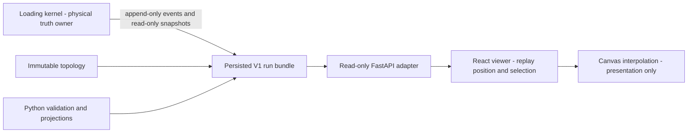

# Urban Cybernetics V1 architecture

## Decision

V1 is a local, replay-first scientific evidence viewer. The implementation is:

- Python 3.13, FastAPI, and Pydantic 2 for the read-only adapter and schema;
- React 19 and TypeScript for the browser application;
- Vite for development and production builds;
- a purpose-built Canvas 2D directed-network renderer;
- Apache ECharts for analytical curves;
- Zod for validation at the browser boundary;
- Vitest and pytest for contract and replay integrity.

FastAPI and Pydantic fit the existing Python ownership model and make the wire
contract explicit without passing arbitrary objects. React supplies a durable
interaction model for inspectors, comparison views, and future authority layers.
Canvas keeps network animation batched and avoids one DOM node per link or packet.
ECharts provides a maintained Canvas chart engine with zoom, overlays, and future
literature-reference support.

## Ownership boundary



The kernel does not import `urban_cybernetics.visualisation`. The V package may
consume `Event`, `Packet`, `CanonicalTopology`, `ValidationContext`, and declared
inspection metadata. The backend has no mutation route. A run is a reloadable
JSON artifact, so browser state does not depend on a surviving engine process.

The browser owns only replay position, playback speed, selected entities,
viewport presentation, and disposable rendering indexes. It selects a complete
Python-derived scientific state for a tick; it does not execute loading,
sending, receiving, node allocation, or queue logic.

## Package structure

- `src/urban_cybernetics/visualisation/contract.py`: strict versioned models.
- `replay.py`: deterministic canonical-event fold.
- `export.py`: adapter from topology and post-run `ValidationContext`.
- `store.py`: validated persisted-artifact registry.
- `server.py`: local GET-only API and built frontend serving.
- `fixtures.py`: rerunnable sanctioned synthetic acceptance run.
- `cli.py`: fixture export and localhost serving.
- `fixtures/visualisation/v1/`: persisted run artifacts.
- `web/src/lib/`: Zod contract, API, replay selection, presentation-only math.
- `web/src/components/`: network, inspector, event stream, and chart surfaces.
- `tests/visualisation/` and `web/src/test/`: integrity tests.

## API shape

The browser loads immutable topology and metadata once, canonical events once in
sequence pages, replay states by tick range, and cumulative link curves lazily by
selected link. The server validates a bundle once and caches that detached model.
No request rebuilds the universe per animation frame.

V1 intentionally uses HTTP GET rather than WebSocket streaming. The first slice
is replay-first and small. A later live-control interface must be separate,
explicit, sanctioned, and engine-owned.

## Developer quick-start

```bash
.venv/bin/pip install -e '.[visualisation,dev]'
cd web
npm install
npm run build
cd ..
.venv/bin/uc-visualisation export-fixture
.venv/bin/uc-visualisation serve --host 127.0.0.1 --port 8000
```

Open `http://127.0.0.1:8000`.

For frontend development:

```bash
# terminal 1
.venv/bin/uc-visualisation serve

# terminal 2
cd web && npm run dev
```

Open `http://127.0.0.1:5173`; Vite proxies `/api` to port 8000.
